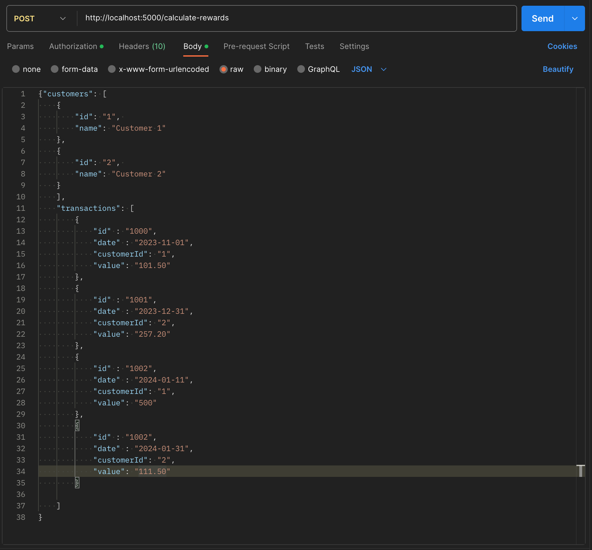

# Retail Rewards Calculator Service
## Description
This service will calculate a three-month summary of customer retail transactions.

Rewards are awarded on the basis: For every dollar spent over $50 on the transaction, the customer receives one point.
In addition, for every dollar spent over $100, the customer receives another point.

Rewards are calculated on whole dollars only.  $50.99 does not receive any rewards. $51 receives 1 point.
## API Summary

The URL for this is (hostname)/calculate-rewards

This service runs on port 5000 if you are running the app locally.

A Post request should be made to the above Rest endpoint with a Request Body containing the data to calculate.

### Request Body
The request body must contain two lists: `customers` and `transactions`.

All the properties of the objects in these lists need to sent over as **String** types. However, they must be formatted so they can be parsed as the type indicated in the description below.
This allows the API to easily parse all the objects and send back a full list of any data issues in one request.

### Response Body
A single object is returned in the Response Body which contains two lists: `customerSummaries` and `errors`.

Only one of these lists will be populated in the response body.  In order to get a successful calculation of rewards, the all the data must be formatted correctly.

## API Details

### Request Body definition
As stated above, the request body must contain two lists: `customers` and `transactions`.

The Customer list contains Customer objets, the Transaction list contains Transaction objects.
#### Customer Object
A customer object must contain two properties:
1. `id` : integer contained in quotes
2. `name` : String

#### Transaction Object
A transaction must contain four properties:
1. `id` : integer contained in quotes
2. `date`: ISO Format (yyyy-mm-dd).  Date of the original retail transaction contained in quotes
3. `customerId` : integer contained in quotes
4. `value` : double value contained in quotes. Net value of the retail transaction (see **Credits** comment in the validation section below)

#### Sample Request Body

```json
{
    "customers": [
        {
            "id": "1",
            "name": "Customer 1"
        },
        {
            "id": "2",
            "name": "Customer 2"
        }
    ],
    "transactions": [
        {
            "id" : "100",
            "date" : "2023-03-01",
            "customerId": "1",
            "value": "101.50"
        },
        {
            "id" : "100",
            "date" : "2023-05-31",
            "customerId": "2",
            "value": "500"
        }
    ]
}
```
### Validation Rules
1. As stated above, all property values must be sent as string type, and be able to be parsed into the correct type listed above by the standard Java parsers.

2. If a customer id is present on a transaction then the same id must be present in the customer list.

3. **Credits**: Negative transaction values will cause the file to be rejected.  A Return (credit/negative) transaction can only be evaluated for the effect on the points reward if the original transaction is known.  Therefore, any returns against a sale transaction must be applied to the original sale transaction prior to handing the data off to this service. The value of the transaction should be the net value.

4. More than 3 months of data.  This service is designed to provide a maximum of three complete calendar months of summaries. If the transaction data provided contains data for more than three consecutive calendar months the file will be rejected.

### Response Body Definition

#### Customer Summary Object
The customer summary object will contain 5 properties:
1. `CustomerId`: int
2. `customerName`: string
3. `month1Rewards`: int
4. `month2Rewards`: int
5. `month3Rewards`: int
6. `totalRewards`: int.  Sum of the 3 individual months.

### Error object
The error object contains a single string.  For certain errors the corresponding object from the request body is identified at the beginning of the error message to assist in locating the transaction.

The response will be returned as failure with either a response code of 400 or 422 if the errors list is populated.

### Sample Successful Response Body:
```json
{
    "customerSummaries": [
        {
            "customerId": 1,
            "customerName": "Customer 1",
            "month1Rewards": 52,
            "month2Rewards": 0,
            "month3Rewards": 0,
            "totalRewards": 52
        },
        {
            "customerId": 2,
            "customerName": "Customer 2",
            "month1Rewards": 0,
            "month2Rewards": 0,
            "month3Rewards": 850,
            "totalRewards": 850
        }
    ],
    "errors": []
}
```

### Sample Error Response Body
```json
{
    "customerSummaries": [],
    "errors": [
        "Customer{id='badId', name='Customer 1'} : has an invalid customer id.",
        "Customer{id='null', name='Customer 2'} : has an invalid customer id.",
        "RetailTransaction{id='null', date='null', customerId='null', value='null'} : has invalid transaction date.",
        "RetailTransaction{id='null', date='null', customerId='null', value='null'} : has invalid customer id.",
        "RetailTransaction{id='null', date='null', customerId='null', value='null'} : has invalid value.",
        "RetailTransaction{id='null', date='null', customerId='null', value='null'} : has invalid transaction id.",
        "RetailTransaction{id='100', date='2023-5-31', customerId='2', value='-500'} : has invalid transaction date.",
        "RetailTransaction{id='100', date='2023-5-31', customerId='2', value='-500'} : has a negative value."
    ]
}
```

## Health Check API
A health check API is available at (hostname)/actuator/health

## Code Correctness
This codebase has a complete suite of unit tests.

They can be run from the command line from the root directory of this project by using the command `./gradlew clean test`

Test results can be found by pointing your browser to the /build/reports/test/test/index.html file in the root directory of this project.

Or use your favorite IDE to run the test in that.

## Docker Container
This app has been containerized.

Assuming you have docker installed on you system then the following command will start up a container with the app.

`docker container run -d -p 5000:5000 rsteer34/retail-rewards:v1`

The above command will expose the app on `localhost:5000/`

Running the health check should confirm the app is running: http://localhost:5000/actuator/health

## Sample Dataset
Customer list:

| id | name       |
|----|------------|
| "1" | "Customer 1" |
| "2" | "Customer 2" |

Transaction list:

| id   | date       | customerId | value    |
|------|------------|------------|----------|
| "1000" | "2023-11-01" | "1"         | "101.50" |
| "1001" | "2023-12-31" | "2"         | "257.20" |
| "1002" | "2023-11-01" | "1"         | "500"    |
| "1003" | "2023-11-01" | ""          | "111.15" |

Result Data:

| customerId | customerName | month1Rewards | month2Rewards | month3Rewards | totalRewards |
|------------|--------------|---------------|---------------|---------------|--------------|
| 1          | "Customer 1" | 52            | 0             | 850           | 902          |
| 2          | "Customer 2" | 0             | 364           | 72            | 436          |



